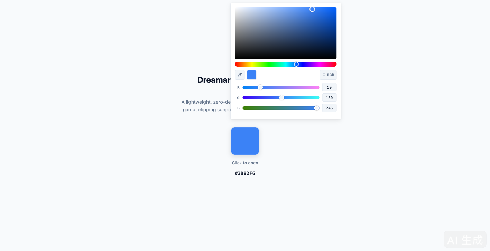
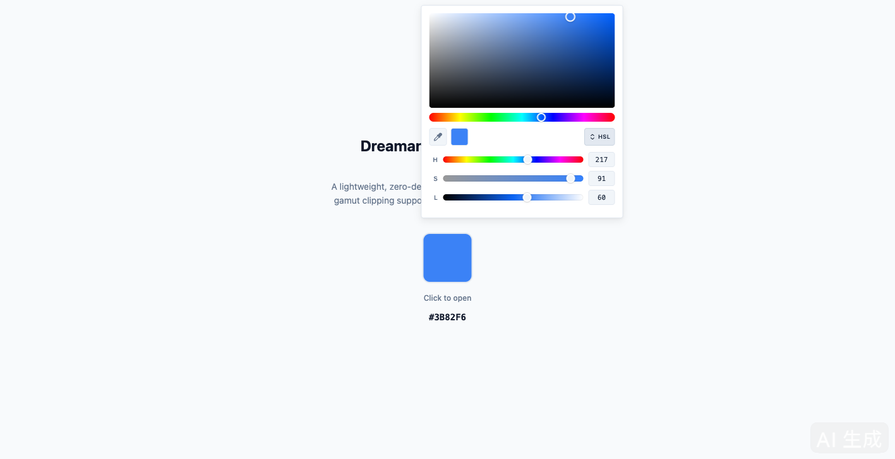
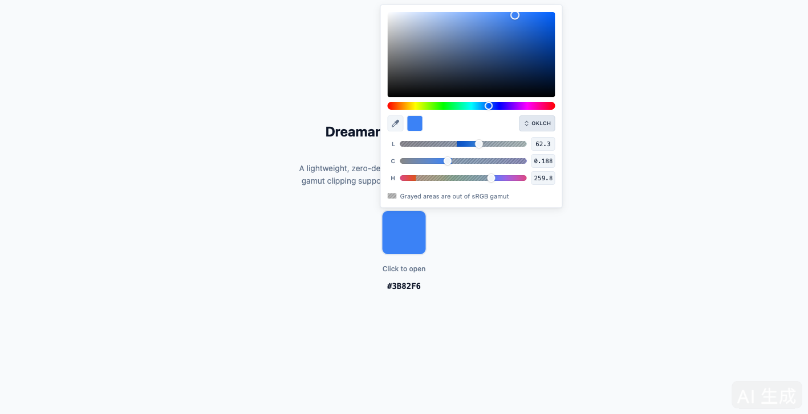
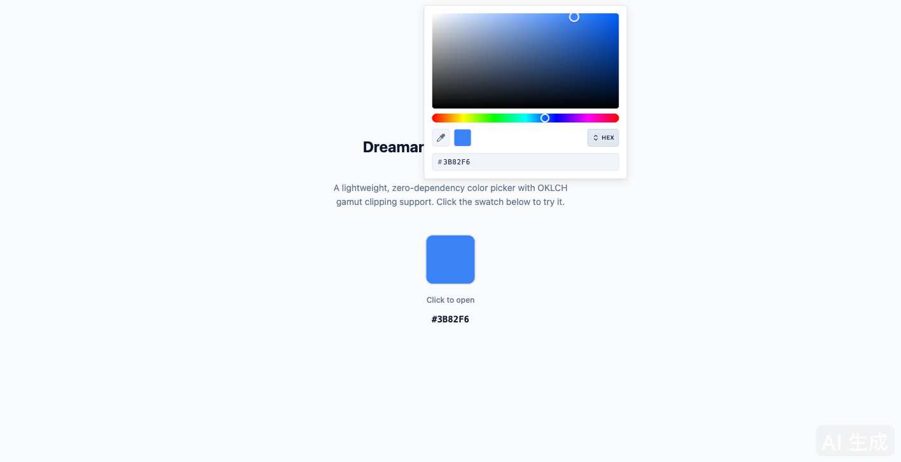

---
AIGC:
  ContentProducer: '001191110102MAD55U9H0F10002'
  ContentPropagator: '001191110102MAD55U9H0F10002'
  Label: '1'
  ProduceID: '4acb2c37-7f0b-4c3d-a45b-458aa5fc1081'
  PropagateID: '4acb2c37-7f0b-4c3d-a45b-458aa5fc1081'
  ReservedCode1: 'c266c8a5-1cbb-4b6d-817a-fcda653f57e3'
  ReservedCode2: 'c266c8a5-1cbb-4b6d-817a-fcda653f57e3'
---

# Dreamanual Color Picker

A lightweight, zero-dependency color picker component with full OKLCH color space support and sRGB gamut clipping.

## Features

- **Zero dependencies** — Pure vanilla JavaScript + CSS, no build tools required
- **4 input modes** — RGB, HSL, OKLCH, HEX (cycle with the toggle button)
- **OKLCH gamut clipping** — Striped masks on OKLCH channel sliders clearly indicate out-of-sRGB-gamut regions; dragging is automatically clamped to in-gamut values
- **Eyedropper tool** — Uses the native EyeDropper API (Chrome / Edge)
- **Popover UI** — Arco Design-inspired, lightweight popup anchored to any element
- **Programmable API** — `setColor()`, `getColor()`, `open()`, `close()`, `destroy()`

## Screenshots

### RGB Mode


The default mode. Pick a color on the SV panel and Hue bar, then fine-tune each RGB channel with gradient sliders. The eyedropper icon on the left lets you sample any color from the screen.

### HSL Mode


Switch to HSL mode via the toggle button. The H slider shows the full hue rainbow; S and L sliders adjust saturation and lightness with real-time gradient previews.

### OKLCH Mode


The OKLCH mode provides perceptually uniform color editing. Out-of-sRGB-gamut regions are marked with hatched stripe overlays on each channel slider — dragging is automatically clamped to valid in-gamut values. The hint bar at the bottom explains the grayed-out areas.

### HEX Mode


A minimal HEX input field for direct hex code entry. Channel sliders are hidden to keep the UI compact.

## Quick Start

### 1. Include the files

```html
<link rel="stylesheet" href="src/color-picker.css">
<script src="src/color-picker.js"></script>
```

### 2. Create a picker instance

```js
const picker = new DreamanualColorPicker({
  initialColor: '#3B82F6',
  onChange: function(hex, rgb, hsl, hsv) {
    console.log('Color changed:', hex);
  },
  onClose: function(hex) {
    console.log('Final color:', hex);
  }
});
```

### 3. Open the picker

```js
// Anchor to a DOM element
const swatch = document.querySelector('.my-swatch');
swatch.addEventListener('click', function(e) {
  e.stopPropagation();
  picker.open(swatch, picker.getColor());
});
```

## API

### Constructor Options

| Option | Type | Default | Description |
|--------|------|---------|-------------|
| `initialColor` | `string` | `'#3B82F6'` | Initial HEX color |
| `onChange` | `function` | `null` | Called on every color change: `onChange(hex, rgb, hsl, hsv)` |
| `onClose` | `function` | `null` | Called when picker closes: `onClose(hex)` |

### Methods

| Method | Description |
|--------|-------------|
| `open(anchorEl, initialColor?)` | Open the picker popover anchored to `anchorEl` |
| `close()` | Close the picker |
| `setColor(hex)` | Set the current color programmatically |
| `getColor()` | Returns the current color as a HEX string (e.g. `'#3B82F6'`) |
| `destroy()` | Remove the picker DOM and clean up |

## OKLCH Gamut Clipping

When in OKLCH mode, the picker performs sRGB gamut boundary detection for each channel:

1. **72-point scan** along the channel range to detect in-gamut / out-of-gamut transitions
2. **Binary search** (20 iterations) to find precise gamut boundary edges
3. **Narrow island filtering** — H channel islands narrower than 15° are removed to prevent confusing tiny in-gamut pockets
4. **Visual masking** — Out-of-gamut regions display a hatched stripe overlay
5. **Drag clamping** — When dragging a slider, values snap to the nearest in-gamut boundary; input fields are clamped on blur

## Browser Support

- Chrome 95+ (EyeDropper API requires Chrome 95+)
- Edge 95+
- Firefox / Safari: Full functionality except the eyedropper tool

## License

MIT

> AI生成